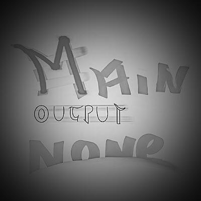

### Olá visitante, ✨
##

###

**Descrição:**

Estudante; Desenvolvendo em: C/C++, Python.

Tenho interesse no futuro da computação com a computação quântica. 

Acredito que a computação quântica se tornará cada vez mais importante e 
relevante em muitas áreas, incluindo a area académica que por sinal é o meu 
foco estudando esta area.
E com a ajuda da inteligência artificial poderemos em alguns anos alcançar grandes feitos, que nos ajudem a compreender a formação de toda a sociedade e como preve-la e melhorar, e tanto quanto compreender cada vez mais o universo, a medida que coletamos cada vez mais dados.

<!---
 -->

<!---

-->

###

<!---  -->
